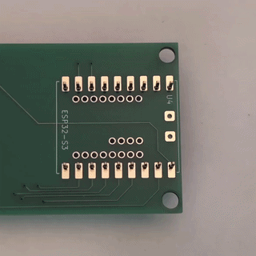
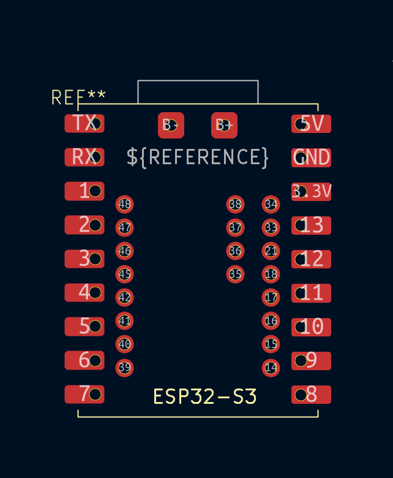

# esp32-s3-super-mini

Resources for the esp32-s3 super mini

## KiCAD

- ESP32-S3 Super Mini Schematic
- ESP32-S3 Super Mini Footprint

# Hardware

Possible source: https://www.nologo.tech/product/esp32/esp32s3/esp32s3supermini/esp32S3SuperMini.html

